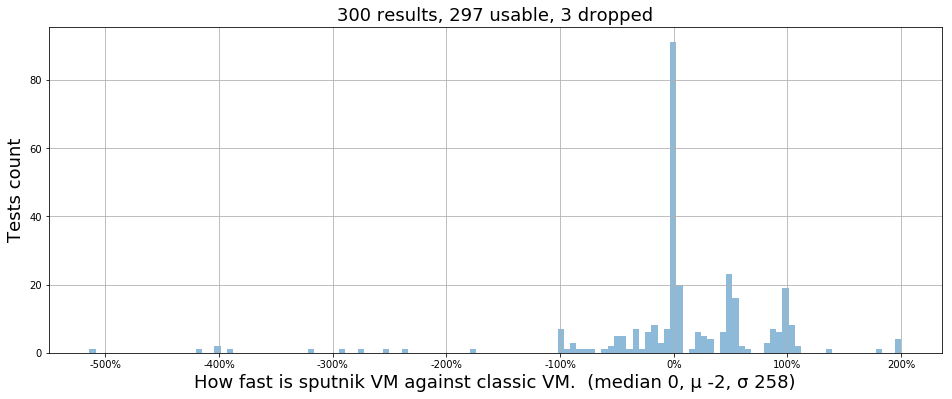
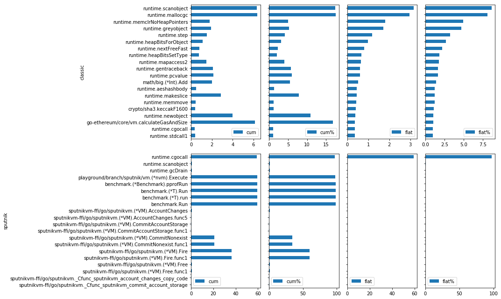
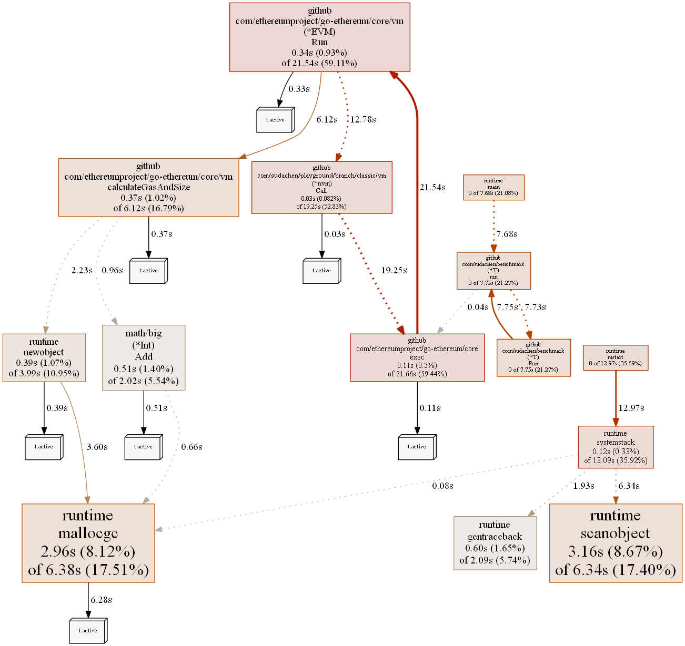
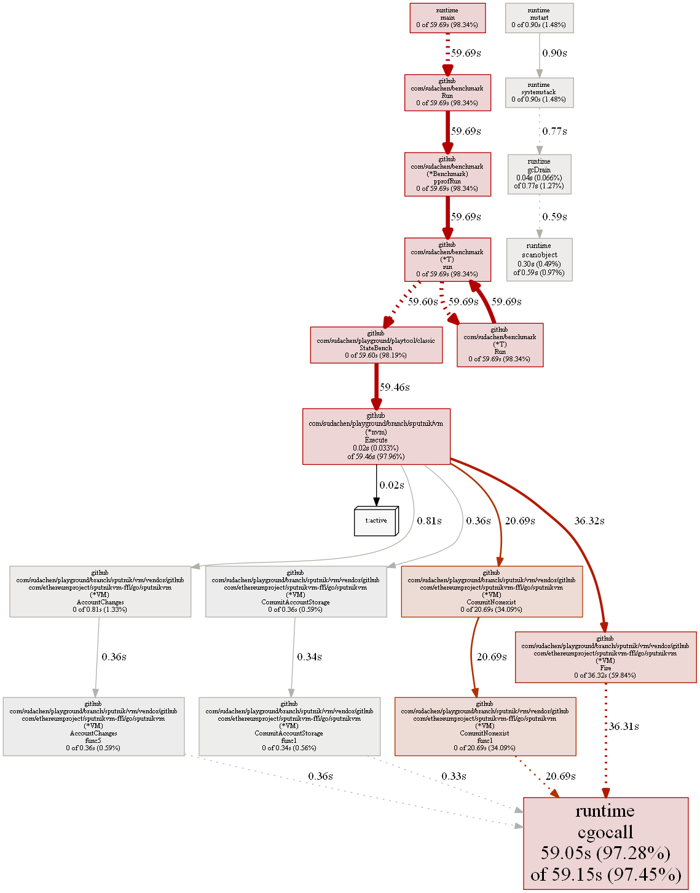
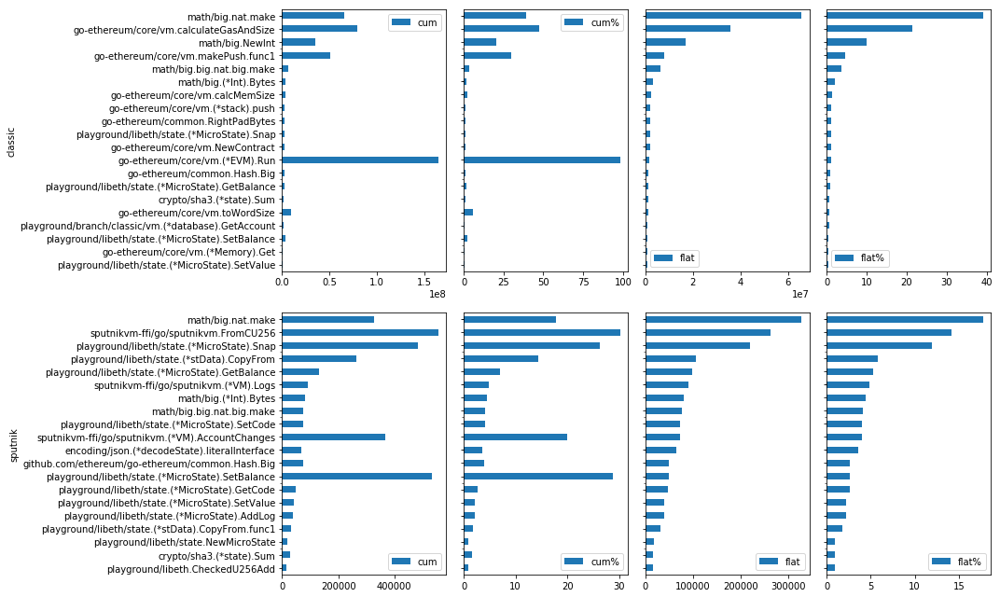
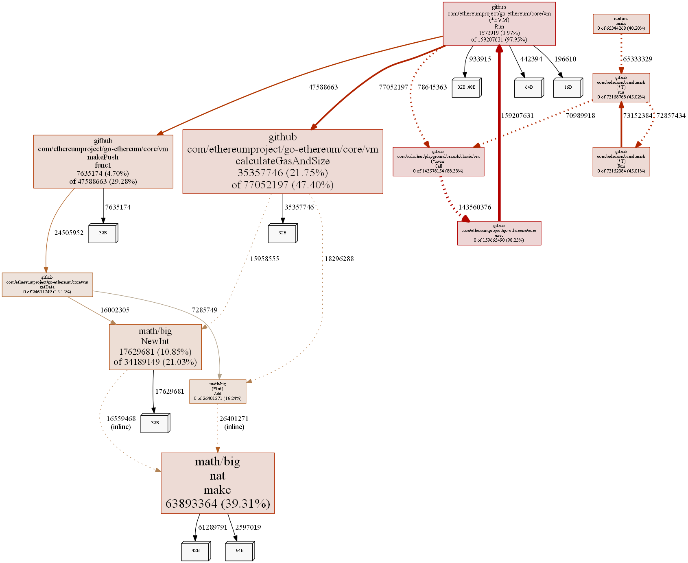
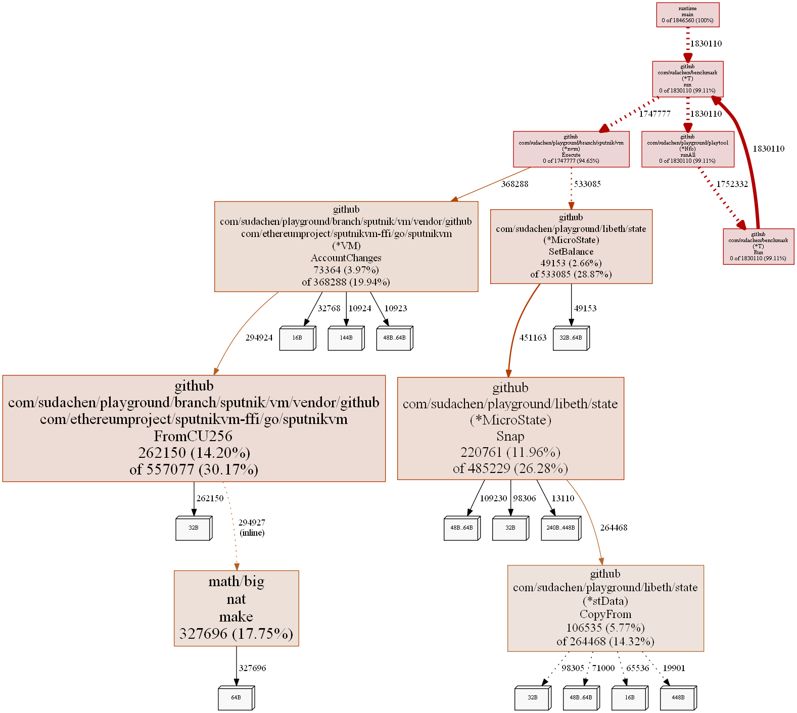

```python
import vmbench
vmbench.bench_and_report('classic','sputnik')
```


# Comparision of Sputnik/Classic VMs benchmarks





# How fast and slow is Sputnik VM against Classic VM by tests


<div>

<table border="1" class="dataframe">
  <thead>
    <tr style="text-align: right;">
      <th></th>
      <th></th>
      <th></th>
      <th></th>
    </tr>
    <tr>
      <th>Name</th>
      <th>Sputnik vs Classic</th>
      <th>Sputnik</th>
      <th>Classic</th>
    </tr>
  </thead>
  <tbody>
    <tr>
      <th>Memory/mload16bitBound</th>
      <th>2204% faster</th>
      <th>0.001s</th>
      <th>0.023s</th>
    </tr>
    <tr>
      <th>CallCreateCallCode/createInitFail_OOGduringInit</th>
      <th>200% faster</th>
      <th>0.001s</th>
      <th>0.003s</th>
    </tr>
    <tr>
      <th>DelegateCall/callOutput3Fail</th>
      <th>200% faster</th>
      <th>0.001s</th>
      <th>0.003s</th>
    </tr>
    <tr>
      <th>Memory/mem32kb_singleByte-32</th>
      <th>200% faster</th>
      <th>0.001s</th>
      <th>0.003s</th>
    </tr>
    <tr>
      <th>Memory/mem64kb_singleByte</th>
      <th>200% faster</th>
      <th>0.001s</th>
      <th>0.003s</th>
    </tr>
    <tr>
      <th>CallCreateCallCode/createInitFailStackUnderflow</th>
      <th>180% faster</th>
      <th>0.001s</th>
      <th>0.003s</th>
    </tr>
    <tr>
      <th>BlockHash/blockhashDOS-sec71</th>
      <th>138% faster</th>
      <th>1.419s</th>
      <th>3.385s</th>
    </tr>
    <tr>
      <th>DelegateCall/callOutput3</th>
      <th>108% faster</th>
      <th>0.001s</th>
      <th>0.002s</th>
    </tr>
    <tr>
      <th>Special/gasPrice0</th>
      <th>107% faster</th>
      <th>0.001s</th>
      <th>0.002s</th>
    </tr>
    <tr>
      <th>DelegateCall/callcodeOutput2</th>
      <th>106% faster</th>
      <th>0.001s</th>
      <th>0.002s</th>
    </tr>
    <tr>
      <th>DelegateCall/delegatecallValueCheck</th>
      <th>106% faster</th>
      <th>0.001s</th>
      <th>0.002s</th>
    </tr>
    <tr>
      <th>Memory/log1_dejavu</th>
      <th>106% faster</th>
      <th>0.001s</th>
      <th>0.002s</th>
    </tr>
    <tr>
      <th>Memory/log4_dejavu</th>
      <th>106% faster</th>
      <th>0.001s</th>
      <th>0.002s</th>
    </tr>
    <tr>
      <th>Memory/mem31b_singleByte</th>
      <th>106% faster</th>
      <th>0.001s</th>
      <th>0.002s</th>
    </tr>
    <tr>
      <th>SystemOperations/createNameRegistratorValueTooHigh</th>
      <th>106% faster</th>
      <th>0.001s</th>
      <th>0.002s</th>
    </tr>
    <tr>
      <th>...</th>
      <th></th>
      <th></th>
      <th></th>
    </tr>
    <tr>
      <th>BlockHash/blockhashInRange</th>
      <th>100% slower</th>
      <th>0.004s</th>
      <th>0.002s</th>
    </tr>
    <tr>
      <th>Transition/createNameRegistratorPerTxsAfter</th>
      <th>100% slower</th>
      <th>0.002s</th>
      <th>0.001s</th>
    </tr>
    <tr>
      <th>Wallet/multiOwnedConstructionNotEnoughGas</th>
      <th>174% slower</th>
      <th>0.011s</th>
      <th>0.004s</th>
    </tr>
    <tr>
      <th>SystemOperations/CallRecursiveBombLog2</th>
      <th>237% slower</th>
      <th>5.237s</th>
      <th>1.550s</th>
    </tr>
    <tr>
      <th>Wallet/dayLimitConstruction</th>
      <th>254% slower</th>
      <th>0.018s</th>
      <th>0.005s</th>
    </tr>
    <tr>
      <th>SystemOperations/CallRecursiveBombLog</th>
      <th>273% slower</th>
      <th>5.726s</th>
      <th>1.535s</th>
    </tr>
    <tr>
      <th>Wallet/dayLimitConstructionOOG</th>
      <th>290% slower</th>
      <th>0.012s</th>
      <th>0.003s</th>
    </tr>
    <tr>
      <th>Wallet/dayLimitConstructionPartial</th>
      <th>317% slower</th>
      <th>0.017s</th>
      <th>0.004s</th>
    </tr>
    <tr>
      <th>Wallet/walletConstruction</th>
      <th>393% slower</th>
      <th>0.025s</th>
      <th>0.005s</th>
    </tr>
    <tr>
      <th>Wallet/multiOwnedConstructionCorrect</th>
      <th>399% slower</th>
      <th>0.015s</th>
      <th>0.003s</th>
    </tr>
    <tr>
      <th>Wallet/multiOwnedConstructionNotEnoughGasPartial</th>
      <th>399% slower</th>
      <th>0.015s</th>
      <th>0.003s</th>
    </tr>
    <tr>
      <th>Wallet/walletConstructionPartial</th>
      <th>420% slower</th>
      <th>0.026s</th>
      <th>0.005s</th>
    </tr>
    <tr>
      <th>Wallet/walletConstructionOOG</th>
      <th>514% slower</th>
      <th>0.025s</th>
      <th>0.004s</th>
    </tr>
    <tr>
      <th>RecursiveCreate/recursiveCreateReturnValue</th>
      <th>2124% slower</th>
      <th>33.408s</th>
      <th>1.502s</th>
    </tr>
    <tr>
      <th>SystemOperations/Call10</th>
      <th>2879% slower</th>
      <th>0.596s</th>
      <th>0.020s</th>
    </tr>
  </tbody>
</table>
</div>


# TOP calls





# Top calls on Classic VM





# Top calls on Sputnik VM





# TOP allocs





# Top allocs on Classic VM





# Top allocs on Sputnik VM




