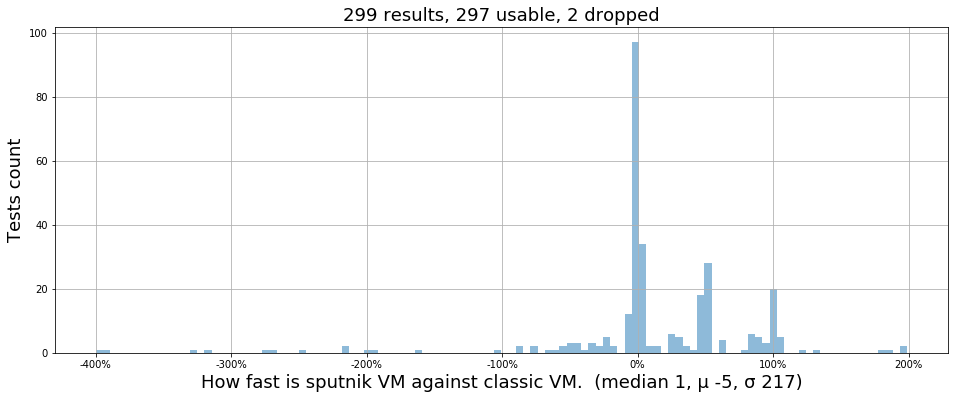

# Comparision of Sputnik/Classic VMs benchmarks

# How fast and slow is Sputnik VM against Classic VM by tests

<table border="1" class="dataframe">
  <thead>
    <tr style="text-align: right;">
      <th></th>
      <th></th>
      <th></th>
      <th></th>
    </tr>
    <tr>
      <th>Name</th>
      <th>Sputnik vs Classic</th>
      <th>Sputnik</th>
      <th>Classic</th>
    </tr>
  </thead>
  <tbody>
    <tr>
      <th>Memory/mem32kb_singleByte-1</th>
      <th>199% faster</th>
      <th>0.001s</th>
      <th>0.003s</th>
    </tr>
    <tr>
      <th>Memory/mem64kb_singleByte+33</th>
      <th>197% faster</th>
      <th>0.001s</th>
      <th>0.003s</th>
    </tr>
    <tr>
      <th>Memory/mem64kb_singleByte+32</th>
      <th>188% faster</th>
      <th>0.001s</th>
      <th>0.003s</th>
    </tr>
    <tr>
      <th>Memory/mem32kb_singleByte-31</th>
      <th>180% faster</th>
      <th>0.001s</th>
      <th>0.003s</th>
    </tr>
    <tr>
      <th>BlockHash/blockhashDOS-sec71</th>
      <th>133% faster</th>
      <th>1.452s</th>
      <th>3.397s</th>
    </tr>
    <tr>
      <th>SystemOperations/CallRecursiveBomb3</th>
      <th>121% faster</th>
      <th>0.103s</th>
      <th>0.228s</th>
    </tr>
    <tr>
      <th>Memory/mem32kb_singleByte-32</th>
      <th>108% faster</th>
      <th>0.001s</th>
      <th>0.002s</th>
    </tr>
    <tr>
      <th>Memory/log4_dejavu</th>
      <th>107% faster</th>
      <th>0.001s</th>
      <th>0.002s</th>
    </tr>
    <tr>
      <th>Memory/mload8bitBound</th>
      <th>107% faster</th>
      <th>0.001s</th>
      <th>0.002s</th>
    </tr>
    <tr>
      <th>DelegateCall/callcodeOutput3partial</th>
      <th>106% faster</th>
      <th>0.001s</th>
      <th>0.002s</th>
    </tr>
    <tr>
      <th>Memory/mstroe8_dejavu</th>
      <th>106% faster</th>
      <th>0.001s</th>
      <th>0.002s</th>
    </tr>
    <tr>
      <th>DelegateCall/callOutput1</th>
      <th>100% faster</th>
      <th>0.001s</th>
      <th>0.002s</th>
    </tr>
    <tr>
      <th>DelegateCall/callcodeOutput1</th>
      <th>100% faster</th>
      <th>0.001s</th>
      <th>0.002s</th>
    </tr>
    <tr>
      <th>Memory/extcodecopy_dejavu</th>
      <th>100% faster</th>
      <th>0.001s</th>
      <th>0.002s</th>
    </tr>
    <tr>
      <th>Memory/log2_dejavu</th>
      <th>100% faster</th>
      <th>0.001s</th>
      <th>0.002s</th>
    </tr>
    <tr>
      <th>...</th>
      <th></th>
      <th></th>
      <th></th>
    </tr>
    <tr>
      <th>SystemOperations/suicideSendEtherToMe</th>
      <th>105% slower</th>
      <th>0.002s</th>
      <th>0.001s</th>
    </tr>
    <tr>
      <th>CallCreateCallCode/createJS_ExampleContract</th>
      <th>162% slower</th>
      <th>0.008s</th>
      <th>0.003s</th>
    </tr>
    <tr>
      <th>Wallet/multiOwnedConstructionNotEnoughGas</th>
      <th>196% slower</th>
      <th>0.012s</th>
      <th>0.004s</th>
    </tr>
    <tr>
      <th>Wallet/dayLimitConstructionOOG</th>
      <th>200% slower</th>
      <th>0.012s</th>
      <th>0.004s</th>
    </tr>
    <tr>
      <th>SystemOperations/CallRecursiveBombLog2</th>
      <th>216% slower</th>
      <th>4.862s</th>
      <th>1.538s</th>
    </tr>
    <tr>
      <th>Wallet/dayLimitConstruction</th>
      <th>217% slower</th>
      <th>0.016s</th>
      <th>0.005s</th>
    </tr>
    <tr>
      <th>SystemOperations/CallRecursiveBombLog</th>
      <th>249% slower</th>
      <th>5.282s</th>
      <th>1.510s</th>
    </tr>
    <tr>
      <th>Wallet/multiOwnedConstructionNotEnoughGasPartial</th>
      <th>268% slower</th>
      <th>0.015s</th>
      <th>0.004s</th>
    </tr>
    <tr>
      <th>Wallet/multiOwnedConstructionCorrect</th>
      <th>276% slower</th>
      <th>0.015s</th>
      <th>0.004s</th>
    </tr>
    <tr>
      <th>Wallet/dayLimitConstructionPartial</th>
      <th>319% slower</th>
      <th>0.017s</th>
      <th>0.004s</th>
    </tr>
    <tr>
      <th>Wallet/walletConstructionPartial</th>
      <th>328% slower</th>
      <th>0.026s</th>
      <th>0.006s</th>
    </tr>
    <tr>
      <th>Wallet/walletConstruction</th>
      <th>393% slower</th>
      <th>0.025s</th>
      <th>0.005s</th>
    </tr>
    <tr>
      <th>Wallet/walletConstructionOOG</th>
      <th>400% slower</th>
      <th>0.025s</th>
      <th>0.005s</th>
    </tr>
    <tr>
      <th>RecursiveCreate/recursiveCreateReturnValue</th>
      <th>2013% slower</th>
      <th>31.302s</th>
      <th>1.481s</th>
    </tr>
    <tr>
      <th>SystemOperations/Call10</th>
      <th>2883% slower</th>
      <th>0.599s</th>
      <th>0.020s</th>
    </tr>
  </tbody>
</table>

# TOP calls

# Top calls on Classic VM

# Top calls on Sputnik VM

# TOP allocs

# Top allocs on Classic VM

# Top allocs on Sputnik VM

